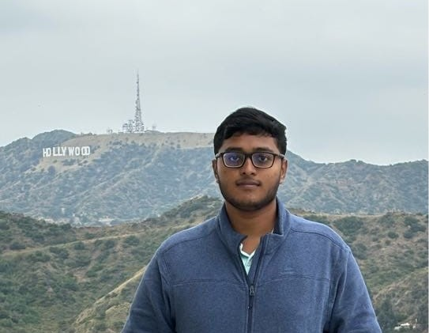

---
# Feel free to add content and custom Front Matter to this file.
# To modify the layout, see https://jekyllrb.com/docs/themes/#overriding-theme-defaults

layout: home
title: About Me
order: 5
---

{:height="250px"}

[GitHub](https://github.com/justaguyalways) / [LinkedIn](https://www.linkedin.com/in/a-s-poornash/) / [Google Scholar](https://scholar.google.co.in/citations?user=clThLIwAAAAJ&hl=en) / [Email](mailto:poornash_2101cs01@iitp.ac.in)

_Welcome to my homepage._

Hello! I’m Poornash Anandan Sangeetha (often going by A S Poornash), an incoming M.S. student in Machine Learning at [Carnegie Mellon University (CMU)](https://www.cmu.edu/), USA (2025-2027). I recently graduated as the Institute Topper (President’s Gold Medalist) in Computer Science and Engineering from the [Indian Institute of Technology Patna (IIT Patna)](https://www.iitp.ac.in/), with a GPA of 9.71/10.

I served as a Machine Learning Intern at [Amazon Applied Science](https://www.amazon.science/) (Jan-Jul 2025), where I developed automated workflows for vision-language product matching, achieving over 90% reduction in manual review time and significant gains in classification metrics. Before this, I worked as a researcher in the [ODDS Research Group](https://sites.usc.edu/razaviyayn/group/) at the [University of Southern California (USC)](https://www.usc.edu/), advised by [Prof. Meisam Razaviyayn](https://sites.usc.edu/razaviyayn/), focusing on private, fair, and federated machine learning, as part of the competitive [IUSSTF-Viterbi India Scholar program](https://iusstf.org/iusstf-viterbi-program).

At [IIT Patna](https://www.iitp.ac.in/), I completed my undergraduate thesis under [Prof. Sriparna Saha](https://www.iitp.ac.in/~sriparna/) and worked on research problems in NLP and multimodal learning (including projects accepted at conferences and journals like ACL, ACM Multimedia, AAAI, CIKM and, IEEE TCSS). I also collaborated with [Prof. Kitsuchart Pasupa](https://www.it.kmitl.ac.th/~kitsuchart/) (KMITL, Thailand) on hate speech detection for low-resource languages like Thai.

My research interests span natural language processing, multimodal learning, privacy-preserving and fair ML, and trustworthy systems. I have worked on advancing techniques for toxicity detection (especially in code-mixed and multilingual videos), learning in decentralized or low-resource environments, and designing practical interventions for real-world multimodal systems.

Further details and papers are available on my [Publications page](/publications).

---

Some relatively non-academic things about me - 
* I am an avid puzzle solver and pursue [speedcubing](https://en.wikipedia.org/wiki/Speedcubing) in a competitive manner. ([My WCA profile link](https://www.worldcubeassociation.org/persons/2017ANAN08))
* Quite a philosopher myself. Speak 4 languages. 

Please read my [CV](/cv) or visit [Scholar profile](https://scholar.google.co.in/citations?user=clThLIwAAAAJ&hl=en) to learn more about my work and interests.       

## News

**_January 2025_**: Started my internship as an Applied Scientist Intern at the **Amazon Global Store Tech** team in Noida, India. Curious to explore the industrial side of ML!

**_December 2024_**: An initial version of my paper titled "A Stochastic Optimization Framework for Private and Fair Learning From Decentralized Data" 
was accepted at the **PPAI-Workshop @ AAAI-2025**! This work was a result of my research fellowship at USC.

**_October 2024_**: My team, **_DBkaScam_**, placed **6th** among **20,000+** teams in the prestigious **Amazon ML Challenge 2024**! Check out our [winning solution](https://www.canva.com/design/DAGRau30tRI/06v7kPdBwb99GDjsiv1fcg/edit?utm_content=DAGRau30tRI&utm_campaign=designshare&utm_medium=link2&utm_source=sharebutton).

**_July 2024_**: Paper titled "Seeing Beyond Words: Multimodal Aspect-Level Complaint Detection in Ecommerce Videos" accepted at **ACM MM 2024** as an **Oral Presentation** (<3% acceptance rate).

**_June 2024_**: Paper titled "ToxVI: A Multimodal LLM-based Framework for Generating Intervention in Toxic Code-Mixed Videos" accepted at **CIKM 2024**. This extends our earlier ACL work to further mitigate the spread of toxic posts on social media.

**_May 2024_**: Started my internship at the ODDS Research group at **USC** as one of the **15 IUSSTF-Viterbi Research Scholars** selected from across India. Looking forward to a great summer in Los Angeles!

**_May 2024_**: Paper titled "ToxVidLM: A Multimodal Framework for Toxicity Detection in Code-Mixed Videos" accepted at the **Findings of ACL 2024**. See you in **Thailand**!

**_November 2024_**: Paper titled "HateThaiSent: Sentiment-Aided Hate Speech Detection in Thai Language" accepted at **IEEE Transactions on Computational Social Systems (IEEE TCSS)**. This work was done as part of my research internship at [KMITL, Thailand](https://www.kmitl.ac.th/).

**_May 2023_**: Paper titled "APTSumm at BioLaySumm Task 1: Biomedical Breakdown, Improving Readability by Relevancy Based Selection" accepted to the **BioNLP Workshop @ ACL 2023**. This was my **first-ever research project**.

