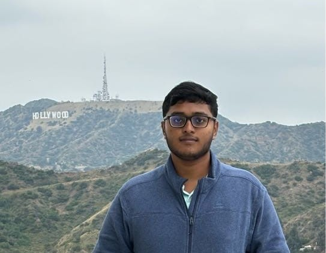

---
# Feel free to add content and custom Front Matter to this file.
# To modify the layout, see https://jekyllrb.com/docs/themes/#overriding-theme-defaults

layout: home
title: About Me
order: 5
---

{:height="250px"}

[GitHub](https://github.com/justaguyalways) / [LinkedIn](https://www.linkedin.com/in/a-s-poornash-4973a2240/) / [Google Scholar](https://scholar.google.co.in/citations?user=clThLIwAAAAJ&hl=en) / [Email](mailto:poornash_2101cs01@iitp.ac.in)

_Welcome to my homepage._

Hello! I’m Poornash Anandan Sangeetha (often going by A S Poornash), a final-year B.Tech student in the Department of Computer Science and Engineering at the [Indian Institute of Technology Patna](https://www.iitp.ac.in/).

I’m currently an Applied Scientist Intern at Amazon India and a Research Assistant at the [University of Southern California (USC)](https://www.usc.edu) in the [ODDS Lab](https://sites.usc.edu/razaviyayn/group/) led by [Prof. Meisam Razaviyayn](https://sites.usc.edu/razaviyayn/). The latter role grew out of the prestigious _Indo-U.S. Science and Technology Forum (IUSSTF)-Viterbi Summer Research Program_ at the [USC Viterbi School of Engineering](https://viterbischool.usc.edu). My research focus is centered on _Natural Language Processing (NLP), Multimodal systems, AI for Social Good_, and specially research problems in _Trustworthy AI, including fairness and differential privacy_.

I am fortunate to have [Prof. Sriparna Saha](https://www.iitp.ac.in/~sriparna/) as my thesis advisor at IIT Patna, where I’m exploring NLP and multimodal systems. My collaborations with [Prof. Kitsuchart Pasupa](https://www.it.kmitl.ac.th/~kitsuchart/) (King Mongkut’s Institute of Technology Ladkrabang, Thailand) and [Prof. Sriparna Saha](https://www.iitp.ac.in/~sriparna/) have led to multiple first-author publications. These include papers in reputed conferences such as the _Annual Meeting of the Association for Computational Linguistics_ (_ACL_), _ACM Multimedia_ (_ACM MM_), and the _Conference on Information and Knowledge Management_ (_CIKM_), as well as articles in the _IEEE Transactions on Computational Social Systems_ (_TCSS_).

Some relatively non-academic things about me - 
* I am an avid puzzle solver and pursue [speedcubing](https://en.wikipedia.org/wiki/Speedcubing) in a competitive manner. ([My WCA profile link](https://www.worldcubeassociation.org/persons/2017ANAN08))
* I am also volunteer in the National Service Scheme (NSS) at IIT Patna, participating in cleanliness drives and teaching Maths at a nearby public primary school.
* Quite a philosopher myself. Speak 4 languages. 

Please read my [CV](/cv) or visit [Scholar profile](https://scholar.google.co.in/citations?user=clThLIwAAAAJ&hl=en) to learn more about my work and interests.       

